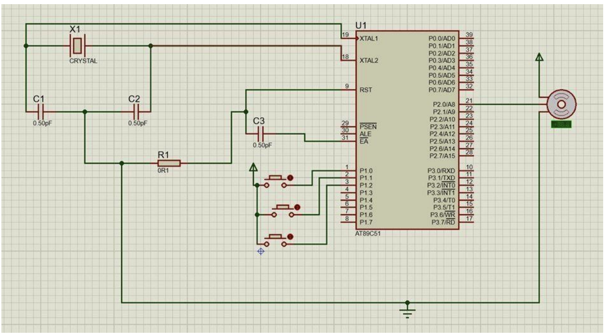

# HelioTrack-Real-Time-Solar-Positioning-System


**Author:** Bhavana Poli  
**Date:** October 2022  
**Course:** Embedded Systems (19CSE303)  
**Institution:** ASE, Chennai  

---

## 📝 Overview

**HelioTrack** is a real-time clock (RTC)-based solar tracking system designed to improve the efficiency of solar panels by dynamically adjusting their orientation with respect to the sun's position throughout the day.

This embedded system project utilizes the **AT89C51 microcontroller**, **servo motors**, and **LDR sensors** to monitor light intensity and reposition the panel accordingly. The implementation led to a **32% increase in power generation** compared to static solar panels.

---

## ⚙️ Components Used

- AT89C51 Microcontroller
- Real Time Clock (RTC - DS1307)
- LDR Sensors (x3)
- DC/Servo Motor
- LCD Display
- Crystal Oscillator
- Voltage Regulator (7805)
- Capacitors, Resistors, Switches
- Solar Panel
- Power Supply (12V 4A Battery)
- **Proteus** for simulation
- **Keil uVision** for code compilation

---

## 🧠 Features

- **Time-based panel tilting** using RTC.
- Manual tilt input through push buttons.
- Display of tilt status and panel voltage on LCD.
- Real-time motor control based on light intensity and preset timings.
- Proteus simulation demonstrating functional tracking mechanism.

---

## 🖥️ Simulation Snapshot



---

## 📜 Code Snippet

```c
#include <reg51.h>
#include <intrins.h>

sbit servo_pin = P2^0;
sbit LDR1 = P1^0;
sbit LDR2 = P1^1;
sbit LDR3 = P1^2;

void delay(unsigned int);
void servo_delay(unsigned int);

void main() {
    servo_pin = 0;
    P1 = 0;
    while(1) {
        if (LDR1 == 1) {
            servo_pin = 1;
            servo_delay(50);
            servo_pin = 0;
            delay(1000);
        }
        if (LDR2 == 1) {
            servo_pin = 1;
            servo_delay(123);
            servo_pin = 0;
            delay(1000);
        }
        if (LDR3 == 1) {
            servo_pin = 1;
            servo_delay(166);
            servo_pin = 0;
            delay(1000);
        }
    }
}
📊 Results
Time	Panel Voltage (V)
8:00AM	9.1
9:00AM	12.9
10:00AM	15.2
11:00AM	17.1
12:00PM	18.9
2:00PM	16.9
4:00PM	14.8

🔍 Applications
Rural and remote power generation

Smart renewable energy systems

Educational embedded electronics projects

🔮 Future Scope
Dual-axis tracking for even greater efficiency.

IoT integration for remote monitoring.

Adaptive learning algorithm for cloudy conditions.

